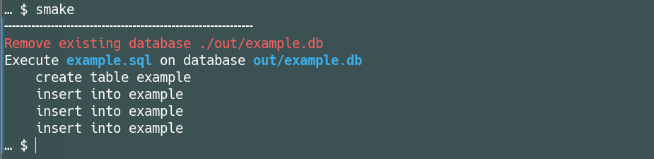
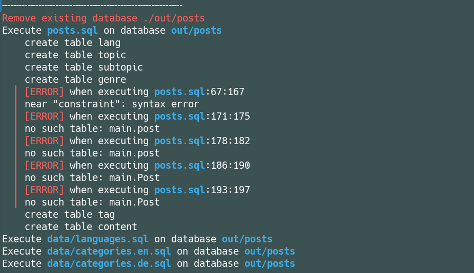

# SMake

SMake is a command-line tool designed to create SQLite databases from multiple SQL source files.

## Outline of Functionalities

Configurations (builds) for any number of SQLite databases are defined by a JSON file. SMake then executes the listed SQL scripts in sequence with the specified options such as enabling foreign key constraints, or whether to replace an existing/previously built database. If an error occurs, at least the numbers of the first and last line of the relevant statement are displayed.

## Installation

SMake is a standalone Python script and does not require installation. Make sure you have at least Python 3.10 or higher on your system.

SQLite is obtained directly from the Python Standard Library, so there are no third-party dependencies.

### Linux

1. Place program file `smake` (without Python extension `py`) under `~/local/bin` (Linux).

2. In the hidden file `.bashrc` located in the user's home directory, write the following line of code,

   `export PATH=$HOME/.local/bin:$PATH`

   if this search path for executable scripts is not yet known.
3. Make the script file executable with `chmod +x smake`.

## Usage

The usage is similar to `make`, in that the entire program input is taken from a local file – more precisely a JSON file:

```json
{
    "out/example.db": {
        "replacing": true,
        "strict": true,
        "scripts": ["example.sql"]
    }
}
```

By simply calling the program `smake` the database gets assembled according to the listed scripts.

### Build Configuration

| Field      | Type     | Description |
|------------|---------|-------------|
| `replacing` | Boolean | If `true`, deletes existing database before creation. |
| `strict`   | Boolean | Enables SQLite foreign key constraints. |
| `scripts`  | List    | List of SQL script files to execute. |

### Initialize Project

To create a sample configuration file (`smake.json`) and an example SQL script (`example.sql`), run:

```sh
./smake init
```

## Feedback and Error Handling

As a small special feature, SMake provides feedback on all executed instructions:

<div align="center">
    
</div>

Furthermore, there are colored warnings and errors with line numbers for better debugging:

<div align="center">
    
</div>

## License

This software is released into the public domain under [The Unlicense](http://unlicense.org/).
